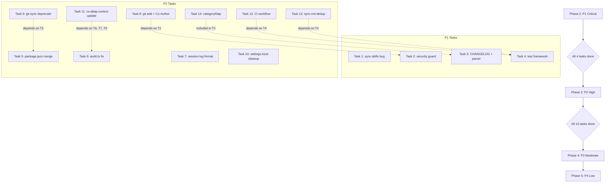

# Project Review Remediation Design: abap_vibe_coding

**Date:** 2026-07-09
**Status:** Approved
**Author:** PM Agent + base-map MCP Analysis (6-domain parallel review)
**Related Plan:** `docs/superpowers/plans/2026-07-09-project-review-remediation.md`

---

## Executive Summary

On 2026-07-09, a comprehensive 6-domain project review was conducted using all specialist agents with base-map MCP for parallel analysis. The review covered **Architecture**, **Sync Pipeline**, **Code Quality**, **Security**, **Documentation**, and **Automation** across 22 agents, 14 skills, 25 scripts, and 26+ documentation files.

The review identified **30 distinct issues** (4 Critical, 10 High, 10 Moderate, 6 Low). The project has successfully completed its initial implementation phase but requires significant hardening to achieve production-grade quality. The primary systemic issues are:

1. **SSOT violations** — skills duplicated across 4 directories with fragile sync
2. **Sync pipeline fragility** — security guard only checks untracked files, CHANGELOG parser produces escaped output
3. **Zero test coverage** — no test framework or test files exist
4. **Documentation drift** — specs don't match implementations, stale counts in context files

This design document outlines a phased remediation strategy: Stability → Coherence → Quality → Cleanup.

---

## Review Findings Summary

| Severity | Count | Key Themes |
|:--------:|:-----:|------------|
| 🔴 **Critical** | 4 | Security guard bypass, Windows path bug, zero tests, CHANGELOG corruption |
| 🟡 **High** | 10 | SSOT violations, CI absence, doc staleness, sync pipeline flaws |
| 🟢 **Moderate** | 10 | Type safety erosion, parser fragility, dual indexes, hook issues |
| ℹ️ **Low** | 6 | CLI tooling, template gaps, documentation polish |
| **Total** | **30** | |

### Domain-Level Breakdown

| Domain | Critical | High | Moderate | Low |
|--------|:--------:|:----:|:--------:|:---:|
| **Architecture** | — | 2 (SSOT, dual package.json) | 2 (dual indexes, MCP config drift) | — |
| **Sync Pipeline** | 2 (security guard, path bug) | 4 (git add, Co-Author, git-sync overlap, categoryMap) | 2 (dedup check, session log format) | — |
| **Code Quality** | 1 (zero tests) | — | 2 (any types, custom parser) | 2 (CLI parsing, error classification) |
| **Security** | 1 (staged secrets bypass) | — | — | 1 (.env.sample validation) |
| **Documentation** | 1 (CHANGELOG regression) | 2 (context.md stale, co-abap outdated) | 2 (AGENTS.md God Object, CLAUDE/GEMINI drift) | 1 (deliverables template gap) |
| **Automation** | — | 2 (CI absence, audit.ts CONSTITUTION) | 2 (githooks manual, pre-commit flow) | — |

---

## Design Principles

All remediation work follows these 5 principles:

1. **Single Source of Truth (SSOT):** `skills/` is the canonical skill source; `package.json` (root) is the sole dependency manifest; `.mcp.json` is the sole MCP config.
2. **Cross-Platform:** All path handling uses `path.normalize()` — no `path.sep` string concatenation. All scripts are TypeScript (Bun) — no `.sh`/`.ps1` pairs.
3. **Security-First:** Sensitive file guards scan the staged index, not just untracked files. No `git add -A` without pre-scan.
4. **Idempotency:** Changelog insertion, memory index update, and skill sync must be safe to run multiple times.
5. **Documentation-Driven:** Every code change includes corresponding doc update. Spec vs. implementation drift is resolved by making code the ground truth and updating specs to match.

---

## Phase-Based Remediation Plan

### Phase 2: Stability (Critical Fixes)

| Task | File(s) | Change |
|------|---------|--------|
| 1 | `scripts/sync-skills.ts` | Fix Phase 2 path.sep bug → `path.normalize()` |
| 2 | `scripts/dev-sync.ts` | Security guard: untracked-only → staged + untracked |
| 3 | `CHANGELOG.md`, `scripts/dev-sync.ts` | Fix 6 escaped entries, fix categoryMap, dedup headers |
| 4 | New test files | Introduce `bun:test` + 3 test suites |

### Phase 3: Coherence (Architectural Alignment)

| Task | File(s) | Change |
|------|---------|--------|
| 5 | `package.json`, `scripts/package.json` | Delete scripts/package.json, merge to root |
| 6 | `scripts/audit.ts` | CONSTITUTION.md check → workspace-level skip/warn |
| 7 | `scripts/dev-sync.ts` | Session log format → match docs/context.md spec |
| 8 | `scripts/dev-sync.ts` | `git add -A` → `git add .`, dynamic Co-Authored-By |
| 9 | `scripts/git-sync.ts` | Add DEPRECATED marker |
| 10 | `.claude/settings.local.json` | Remove orphan script references |
| 11 | `docs/co-abap.context.md` | Update: 14 skills, deprecated scripts, agent counts |
| 12 | `.github/workflows/ci.yml` | New CI workflow (test + audit + verify) |
| 13 | `scripts/sync-md.ts` | Dedup: `includes()` → regex match |
| 14 | `scripts/dev-sync.ts` | CategoryMap: `docs` → `### Added`, prevent duplicate headers |

### Phase 4: Quality (Robustness)

| Task | File(s) | Change |
|------|---------|--------|
| 15 | `scripts/dispatch.ts` | Replace `any` types with interfaces |
| 16 | `scripts/verify-skills.ts` | Improve frontmatter parser boundary checks |
| 17 | `scripts/sync-skills.ts` | Phase 1: whitelist SKILL.md only |
| 18 | `AGENTS.md` | Add `*Last Updated: 2026-07-09*` |
| 19 | `CLAUDE.md`, `GEMINI.md` | Clarify shared vs platform-specific checklist |
| 20 | `.agents/skills.json` | Document role vs SKILLS.md relationship |
| 21 | `scripts/setup.ts` | Add auto githooks installation |
| 22 | `.githooks/pre-commit` | Document flow behavior and limitations |
| 23 | `docs/co-abap.context.md` | Document MCP SSOT principle explicitly |
| 24 | `scripts/dispatch-parallel.ts` | Fix `(parts[3] as any)` cast |

### Phase 5: Cleanup (Polish)

| Task | File(s) | Change |
|------|---------|--------|
| 25 | docs | TODO: CLI parser library evaluation |
| 26 | docs | TODO: Error classification enhancement |
| 27 | `deliverables/templates/` | New `abap_technical_design.md` template |
| 28 | `.env.sample` | Verify placeholder-only content |
| 29 | (covered by Task 18) | — |
| 30 | docs | Defer: scratch/ cleanup automation |

---

## Dependency Map

---

## Success Criteria

1. **`bun test`** — All unit tests pass (retry-handler, verify-skills, sync-md)
2. **`bun scripts/audit.ts`** — Returns exit code 0 (all checks pass)
3. **`bun scripts/verify-skills.ts`** — All 14 skills verified, no warnings
4. **`bun scripts/agent-verify.ts`** — All 22 agents verified, no orphans
5. **CHANGELOG.md** — No escaped characters, correct categorization, no duplicate headers
6. **CI workflow** — Triggers on PR, runs all verification steps

---

*Last Updated: 2026-07-09*
